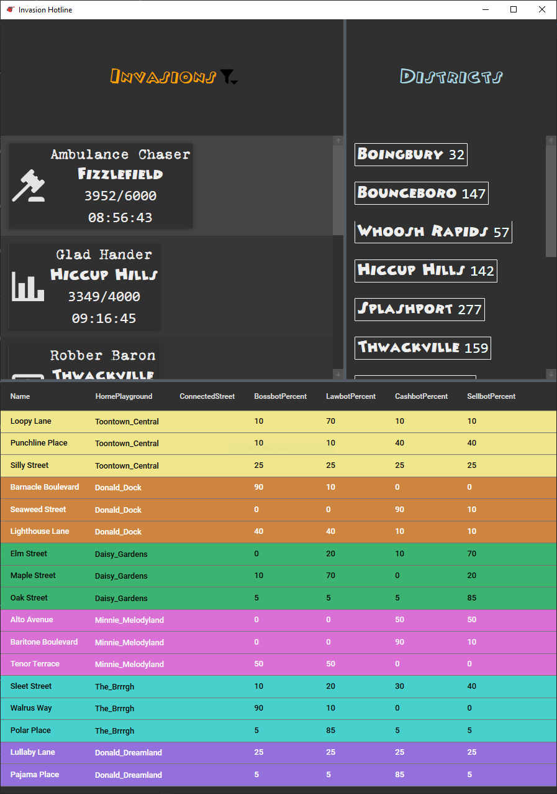

# ToonTown Rewritten Projects
I'm planning to do a couple of projects in C# .NET (Framework and Core) using the REST APIs available.  
My main goal is to allow users to get info about the game like:

- [ ] Server status (pending API Key)
- [x] Invasion Tracking with bot filtering
- [x] District Monitoring with color coding
- [ ] Task Tracking (capstone project for full-stack nanodegree)

##  Invasion Hotline

This was my original project that started all of my dev into TTR data.  
It's operational and I'm hoping to have a stable release soon with all the bells & whistles I want it to have \^\_\^

### Screenshots

## Town Crier
Planned Node.js server to handle polling server status and cacheing values for Invasion Hotline to report game server status.

